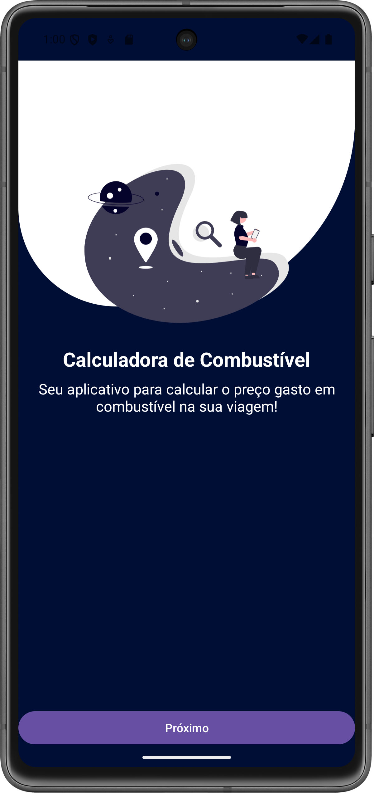
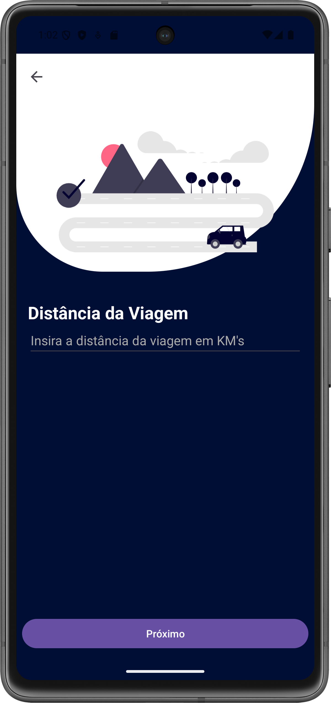
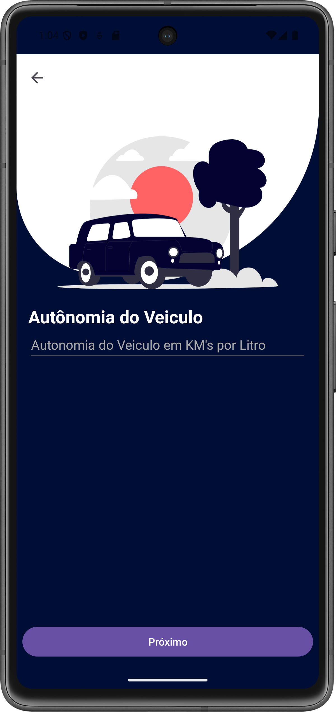

# FuelCalculator

Este projeto é um aplicativo Android simples desenvolvido como parte do curso de Android com Kotlin da [Escola Nova Era](https://www.escolanovaeratech.com.br/android).

## 📝 Descrição

O FuelCalculator é um aplicativo móvel que permite aos usuários calcular o custo total de combustível para uma viagem. O aplicativo funciona em um fluxo de múltiplas telas, coletando dados do usuário passo a passo para fornecer um cálculo preciso e um resumo final.

## ✨ Funcionalidades

O aplicativo é composto por quatro telas principais que guiam o usuário pelo processo de cálculo:

1.  **Tela Inicial (`MainActivity`)**
    * Apresenta o aplicativo com o título "Calculadora de Combustível" e uma breve descrição.
    * Contém um botão "Próximo" que inicia o fluxo de cálculo, levando o usuário para a `DistanciaActivity`.

2.  **Tela de Distância (`DistanciaActivity`)**
    * Solicita ao usuário que insira a "Distância da Viagem" em quilômetros (KM).
    * Ao clicar em "Próximo", o valor da distância é capturado, convertido para `Int` e passado via `Intent` para a próxima tela.

3.  **Tela de Consumo (`KmLitroActivity`)**
    * Recebe o dado de distância da tela anterior.
    * Solicita ao usuário a "Autonomia do Veiculo", ou seja, quantos quilômetros o veículo faz por litro (KM/L).
    * Ao clicar em "Próximo", o valor do consumo é capturado e passado, juntamente com a distância, para a tela seguinte.

4.  **Tela de Preço (`PrecoCombustivelActivity`)**
    * Recebe os dados de distância e consumo.
    * Solicita ao usuário o "Preço do Litro do Combustível".
    * Ao clicar em "Calcular", o aplicativo realiza o cálculo final:
        * `litrosNecessarios = distancia / consumo`
        * `custoTotal = litrosNecessarios * precoCombustivel`
    * Os valores de custo total, preço, distância e consumo são enviados para a tela de resultado.

5.  **Tela de Resultado (`ResultadoActivity`)**
    * Exibe o `custoTotal` calculado de forma destacada.
    * Mostra um resumo dos dados inseridos pelo usuário: "Distância", "Consumo" e "Preço".
    * Possui um botão "Calcular Novamente" que leva o usuário de volta à `MainActivity` para reiniciar o processo.

## 🛠️ Tecnologias Utilizadas

* **Linguagem:** [Kotlin](https://kotlinlang.org/)
* **Arquitetura:** Múltiplas Activities
* **Componentes Nativos Android:**
    * `Activity`
    * `Intent` (para navegação e passagem de dados entre telas)
    * `EditText` (para entrada de dados)
    * `Button`
    * `TextView`
* **UI (Layout):**
    * XML
    * `ConstraintLayout`
* **Bibliotecas AndroidX:**
    * `androidx.appcompat`
    * `com.google.android.material:material` (para componentes do Material Design)
    * `androidx.core:core-ktx`